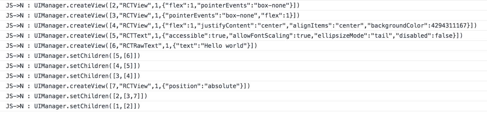

And why it has been designed.

_If you're not familiar with the old React Native architecture and its asynchronous nature, I suggest you take some time to read [Understanding the React Native bridge concept](../understanding-react-native)._


React Native is a powerful tool coming with great concepts that allows to create beautiful native applications using JavaScript. The declarative syntax provided by [React](https://reactjs.org/) and [JSX](https://reactjs.org/docs/introducing-jsx.html) is a killer feature that makes the way we think and design our applications really convenient for both web and mobile platforms ([and even more](https://facebook.github.io/react-360/)).

In 2018, [Parashuram N](https://github.com/axe-fb), a React Native core team member, has made a conference about [the state of React Native](https://www.youtube.com/watch?v=83ffAY-CmL4). During this presentation he explained that React Native is a mature and viable solution but which comes with some inherent drawbacks that can't easily be worked around because of its actual architecture. Then, he reported that the team was discussing about improvements and finally announced that they are coming with a plan for building a new architecture that would make possible things that weren't before.

## But why creating such an architecture?

React Native first architecture has been built around a fully asynchronous design. It means that the different operations are not blocking anything but will be processed only when the CPU isn't busy anymore and when it is able to handle new computations. **It also means that it can (it does actually) exist a time between calling a React Native function / component and its real computation in the device**.

At the beginning, the core team thought that making everything asynchronous would be a strength for the tool. The idea was to avoid blocking the UI thread to have smooth and reactive screen finally reaching the 60fps golden goal.

However, there is a concern to address. **Asynchronous computations ensure that something will happen without blocking, but they don't tell when**. And here's the problem.

 - Going Over The Speed Limit - React Native EU](./blocking.jpeg)

Let's remember the way React Native creates the native views. When we ask React Native to display a component on the device screen, multiple things occur. The first one is that React will make its internal diffing computations and transform the JSX syntax to a JSON object. [Then, the React Native reconciler will take care of that JSON object and will call some functions on its internal UIManagermodule](https://github.com/facebook/react/blob/1e3b6192b54df20ac117a2af56afbe00ac9487b7/packages/react-native-renderer/src/ReactNativeHostConfig.js#L111). The aim of the `UIManager` module is to send information about the view management to the native side thanks to the bridge. The different messages passing from one side to the other of the bridge are queued and executed _when the previous tasks has been handled_, in an asynchronous fashion.



If we take that example and apply it to most of the use cases we use to work on, it's working great and the application has a real native feeling.

The problems come when we try to work on some cases (that are actually not edge cases) and that create specific behaviours making the application not feeling like a "real native app": in some cases, we can distinguish a React Native application of a native one.

To illustrate this statement, a common case showing that asynchronism cannot fit everywhere for React Native is the infinite list example. When we scroll through a huge list, the JavaScript side sends information over the bridge to describe which view to create. If we scroll really fast, multiple information concerning the creation of the list items will be sent over the bridge but the device will potentially not have time to draw them while the scroll is acting. **This is because the message concerning the creation of the list items will be queued and handled only when the device has finished its previous queued tasks**.

Another example is the JavaScript side navigation. When we want to navigate to a new scene using this kind of navigation, the animation provided (like stacking a new view from the right) can be faster than the new page rendering process in React Native. It can lead to white flashes before really rendering the content.


Huge list scrolling is one of the different examples addressed by [Brent Vatne](https://twitter.com/notbrent) in his talk at [ColdFront 2018](https://coldfront.co/):

<iframe width="560" height="315" src="https://www.youtube.com/embed/LMSrRSYDWmg" frameborder="0" allow="accelerometer; autoplay; encrypted-media; gyroscope; picture-in-picture" allowfullscreen></iframe>

## How to avoid these behaviours?

The main answer to this problem is to avoid making every single computation asynchronous in React Native. **React Native is not showing that asynchronous behaviours are something bad or wrong**. It's only showing that they have to be used on certain use cases, **not everywhere**. It's true for React Native but it's probably true for other situations.

One of the main decision they have made is not to rely on Native Modules like the `UIManager` anymore. They are trying to create bridged APIs (bridged in the sense of exposing C++ functions to the JavaScript land) that would look like the ones we use to rely on the web such as the different `document` APIs. Instead of bridging a way to enqueue some computations from both sides, new functions will be exposed to the JavaScript part. When these functions will be called, it's the actual native function that will be executed, just like it works in the web:

```javascript
const element = document.createElement('div')
const childElement = document.createElement('span')
childElement.textContent = 'Hello world'

element.appendChild(childElement)
```

The view creation will be a synchronous operation handled by **a native system**. In the web, `element` is a handler to a native view created and managed by the `document` APIs. We can imagine (and it will probably be the case) to have some APIs like this one to manage views.

## What has been built to resolve these issues?

The whole thing gathering all of these new concepts is called "Fabric". It's the name used by the contributors when they talk about this new architecture.
The capability to call native functions in JavaScript synchronously is called [JSI (JavaScript Interface)](https://github.com/react-native-community/discussions-and-proposals/issues/91).

The `NativeModules` will be replaced by `TurboModules` which represent the new way to call native modules in the JavaScript land using the JSI.

Many other things and the ones I've presented here in this post are listed by the core team in: https://github.com/react-native-community/discussions-and-proposals. If you're a React Native developer, I suggest you check this frequently to get new updates of what's going to happen and to discuss about the new possibilities that this new architecture is going to provide.

[On the same repository, there is an issue that explains what is Fabric.](https://github.com/react-native-community/discussions-and-proposals/issues/4)
