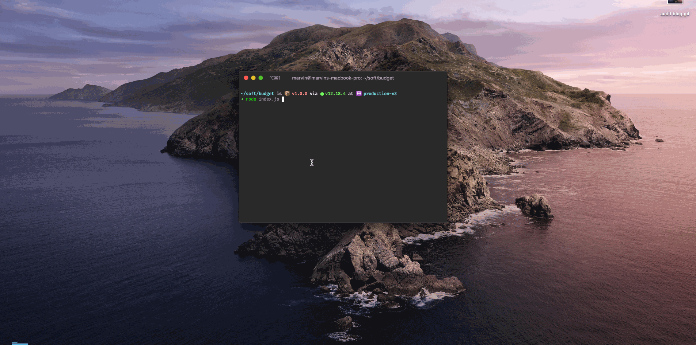

[Gatsby](https://www.gatsbyjs.com/) is one of the most popular tool for people building on top of the JAMstack.

If you've never heard of the JAMstack before, I highly recommend visiting the [https://jamstack.org/](https://jamstack.org/) website that gives clear explanations on the concept and presents its strengths and weaknesses pretty well.

In short, the JAMstack is an architecture allowing static files generation based on any kind of data source.

With that idea in mind, we can imagine building an entire e-commerce site where each of the product will be presented in its own HTML file such as `new-brand-XYZ-product.html`, `new-ABC-show.html` etc...

One of the pros of building on top of the JAMstack is **performances by default**. Since the browser only has to deal with HTML pages, it's supposed to be very fast.

Measuring things can start looking interesting to see the real benefit but also to improve in new areas such as accessibility or SEO.

Here comes [Lighthouse](https://developers.google.com/web/tools/lighthouse). Lighthouse is a tool built by Google that aims to audit frontend applications in order to give developers insights on performances, accessibility, PWA states and a lot of others things - including hints on how to improve.

## Sounds great, but why that post?

The problem I'm facing when dealing with Lighthouse is that **we tend to test only the main pages of a website**.

How many times I faced myself only testing a homepage where I had hundred of publicly accessible pages?

In this post, I would like to provide a recipe on how to automatically run as many Lighthouse tests as the number of pages that a Gatsby site has.

## How to solve this problem?

Obviously a solution is to test more pages to get confidence on the global performance (or anything else) status of the site.

The solution I would like to introduce relies on a `sitemap.xml` file. This file is often used to provide search engine information about the different resources available in a site. 

For example, the actual sitemap of this blog looks like:

```xml
<urlset
    xmlns="http://www.sitemaps.org/schemas/sitemap/0.9"
    xmlns:news="http://www.google.com/schemas/sitemap-news/0.9"
    xmlns:xhtml="http://www.w3.org/1999/xhtml"
    xmlns:mobile="http://www.google.com/schemas/sitemap-mobile/1.0"
    xmlns:image="http://www.google.com/schemas/sitemap-image/1.1"
    xmlns:video="http://www.google.com/schemas/sitemap-video/1.1">
    <url>
        <loc>https://mfrachet.github.io/a-b-testing-with-the-jamstack</loc>
        <changefreq>daily</changefreq>
        <priority>0.7</priority>
    </url>
    <url>
        <loc>https://mfrachet.github.io/the-n-props-syndrome</loc>
        <changefreq>daily</changefreq>
        <priority>0.7</priority>
    </url>
    <url>
        <loc>https://mfrachet.github.io/how-do-i-choose-a-ssr-strategy</loc>
        <changefreq>daily</changefreq>
        <priority>0.7</priority>
    </url>
</urlset>
```

Using these information, we can write a script that will extract the different URL and run a Lighthouse audit against them.

## What to do then?

### Creating a sitemap.xml with Gatsby

We can generate a `sitemap.xml` file with the [gatsby-plugin-sitemap](https://github.com/gatsbyjs/gatsby/tree/master/packages/gatsby-plugin-sitemap) plugin:

```sh
$ yarn gatsby-plugin-sitemap
```

In order to generate a valid site-map, we need to define the `siteMetadata.siteUrl` in the `gatsby-config.js` file which is the production URL of the site. We also have to register the plugins in the plugin array:

```js
// gatsby-config.js
module.exports = {
    siteMetadata: {
        siteUrl: `https://mfrachet.github.io`,
    },
    plugins: [`gatsby-plugin-sitemap`],
};
```

### Transforming sitemap.xml into JSON

In order to transform the `sitemap.xml` content into a computable JSON array, let's create a function using the [xml2js](https://www.npmjs.com/package/xml2js) node module:

```js
const { join } = require('path');
const parseStringPromise = require('xml2js').parseStringPromise;
const fs = require('fs');

const extractUrlsFromSitemap = async () => {
    // Resolve the path of the sitemap.xml file
    // By default, it's located in the ./public folder of your project
    // when running NODE_ENV=prod gatsby build
    const filepath = join(process.cwd(), 'public', 'sitemap.xml');


    // Read the string content of the sitemap.xml
    const fileContent = fs.readFileSync(filepath, 'utf-8');

    // Transform the string content (which is written in XML) into a json object
    const json = await parseStringPromise(fileContent);

    // Browse into the particular shape of the object we get back from the xml2js library
    // We expect an array looking like:
    const urls = json.urlset.url.map((uri) => {
        const url = uri.loc[0];

        // One problem is that sitemap.xml is built using the siteMetadata.siteUrl
        // value. We need to replace this one by a localhost URL in order to run the test locally
        const prodPath = `https://mfrachet.github.io`;
        const localPath = `http://localhost:3000`;

        return url.replace(prodPath, localPath);
    });

    // urls should look like:
    // [
    //  "http://localhost:3000/a-b-testing-with-the-jamstack",
    //  "http://localhost:3000/the-n-props-syndrome",
    //  "http://localhost:3000/how-do-i-choose-a-ssr-strategy"
    // ]
    return urls;
};

module.exports = sitemapTask;
```

### Running Lighthouse

We now have a list of all the URLs that exist for the Gatsby site:

```json
[
    "http://localhost:3000/a-b-testing-with-the-jamstack",
    "http://localhost:3000/the-n-props-syndrome",
    "http://localhost:3000/how-do-i-choose-a-ssr-strategy"
]
```

The next step is to run a Lighthouse audit on every of these.

Lighthouse can be used in different ways: using the cli, in [Cypress](https://www.cypress.io/) tests with [cypress-audit](https://github.com/mfrachet/cypress-audit) or using Node.js. For the sake of clarity, I've decided to use the node module in this example.

```js
// chrome-launcher is a tool that allows to start Chrome and to use the drive it with the devtools protocol
const chromeLauncher = require("chrome-launcher");
const lighthouse = require("lighthouse");

// Let's define performance budgets for the global site
const PERFORMANCE_BUDGET = 50;

const auditUrls = async (urls) => {
  // we create a chrome instance
  const chrome = await chromeLauncher.launch();

  // we create Lighthouse options so that it knows on which chrome instance it has to connect
  const options = { port: chrome.port };

  // for each URL, we run a Lighthouse audit
  // we throw an error when the threshold is crossed.
  // NB: lighthouse retrieves score in decimal like: 0.4. We need to multiply it by 100 to get a percentage value
  for (const url of urls) {
    const runnerResult = await lighthouse(url, options);
    const performance = runnerResult.lhr.categories.performance;

    if (performance.score * 100 < PERFORMANCE_BUDGET) {
      await chrome.kill();
      throw new Error("Oops! Performance thresholds crossed!");
    }
  }

  // Nothing thrown, every tests have succeeded!
  console.log("Everything is passing! Congrats!");
  await chrome.kill();
};
```

### All in one

